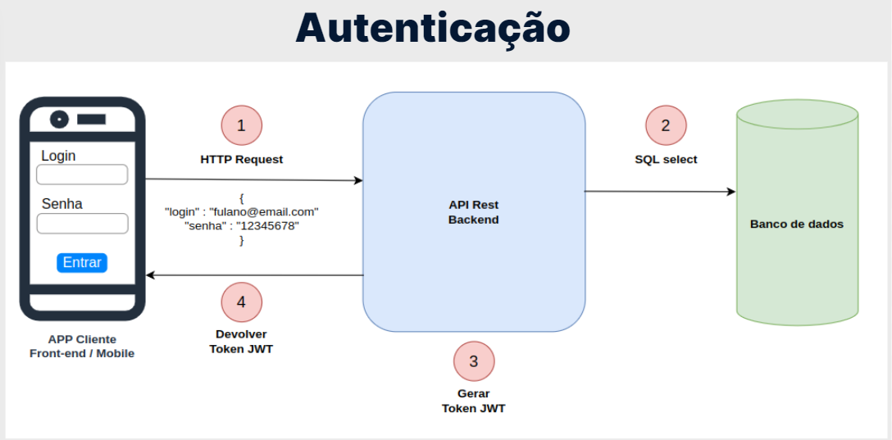

# API

## CORS
- O CORS é um mecanismo utilizado para adicionar cabeçalhos HTTP que informam aos navegadores para permitir que uma aplicação Web seja executada em uma origem e acesse recursos de outra origem diferente. Esse tipo de ação é chamada de requisição cross-origin HTTP. Na prática, então, ele informa aos navegadores se um determinado recurso pode ou não ser acessado.

- Habilitando diferentes origens no Spring Boot
- Para configurar o CORS e habilitar uma origem específica para consumir a API, basta criar uma classe de configuração como a seguinte:

```
@Configuration
public class CorsConfiguration implements WebMvcConfigurer {

    @Override
    public void addCorsMappings(CorsRegistry registry) {
        registry.addMapping("/**")
            .allowedOrigins("http://localhost:3000")
            .allowedMethods("GET", "POST", "PUT", "DELETE", "OPTIONS", "HEAD", "TRACE", "CONNECT");
    }
}

```

## Record
- Lançado oficialmente no Java 16, mas disponível desde o Java 14 de maneira experimental, o Record é um recurso que permite representar uma classe imutável, contendo apenas atributos, construtor e métodos de leitura, de uma maneira muito simples e enxuta.
- Esse tipo de classe se encaixa perfeitamente para representar classes DTO, já que seu objetivo é apenas representar dados que serão recebidos ou devolvidos pela API, sem nenhum tipo de comportamento.
- Para se criar uma classe DTO imutável, sem a utilização do Record, era necessário escrever muito código.
- DTO
```
public final class Telefone {

    private final String ddd;
    private final String numero;

    public Telefone(String ddd, String numero) {
        this.ddd = ddd;
        this.numero = numero;
    }

    @Override
    public int hashCode() {
        return Objects.hash(ddd, numero);
    }

    @Override
    public boolean equals(Object obj) {
        if (this == obj) {
            return true;
        } else if (!(obj instanceof Telefone)) {
            return false;
        } else {
            Telefone other = (Telefone) obj;
            return Objects.equals(ddd, other.ddd)
              && Objects.equals(numero, other.numero);
        }
    }

    public String getDdd() {
        return this.ddd;
    }

    public String getNumero() {
        return this.numero;
    }
}
```
- Record
```
public record Telefone(String ddd, String numero){}
```

### Padrão DAO
- O padrão de projeto DAO, conhecido também por Data Access Object, é utilizado para persistência de dados, onde seu principal objetivo é separar regras de negócio de regras de acesso a banco de dados. Nas classes que seguem esse padrão, isolamos todos os códigos que lidam com conexões, comandos SQLs e funções diretas ao banco de dados, para que assim tais códigos não se espalhem por outros pontos da aplicação, algo que dificultaria a manutenção do código e também a troca das tecnologias e do mecanismo de persistência.

### Implementação
- Vamos supor que temos uma tabela de produtos em nosso banco de dados. A implementação do padrão DAO seria o seguinte:
- Primeiro, seria necessário criar uma classe básica de domínio Produto:
```
public class Produto {
    private Long id;
    private String nome;
    private BigDecimal preco;
    private String descricao;

    // construtores, getters e setters
}
```
- Em seguida, precisaríamos criar a classe ProdutoDao, que fornece operações de persistência para a classe de domínio Produto:
```
public class ProdutoDao {

    private final EntityManager entityManager;

    public ProdutoDao(EntityManager entityManager) {
        this.entityManager = entityManager;
    }

    public void create(Produto produto) {
        entityManager.persist(produto);
    }

    public Produto read(Long id) {
        return entityManager.find(Produto.class, id);
    }

    public void update(Produto produto) {
        entityManger.merge(produto);
    }

    public void remove(Produto produto) {
        entityManger.remove(produto);
   }

}
```
- No exemplo anterior foi utilizado a JPA como tecnologia de persistência dos dados da aplicação.

## Padrão Repository
- De acordo com o famoso livro Domain-Driven Design, de Eric Evans:
- O repositório é um mecanismo para encapsular armazenamento, recuperação e comportamento de pesquisa, que emula uma coleção de objetos.
- Simplificando, um repositório também lida com dados e oculta consultas semelhantes ao DAO. No entanto, ele fica em um nível mais alto, mais próximo da lógica de negócios de uma aplicação. Um repositório está vinculado à regra de negócio da aplicação e está associado ao agregado dos seus objetos de negócio, retornando-os quando preciso.
- Só que devemos ficar atentos, pois assim como no padrão DAO, regras de negócio que estão envolvidas com processamento de informações não devem estar presentes nos repositórios. Os repositórios não devem ter a responsabilidade de tomar decisões, aplicar algoritmos de transformação de dados ou prover serviços diretamente a outras camadas ou módulos da aplicação. Mapear entidades de domínio e prover as funcionalidades da aplicação são responsabilidades muito distintas.
- Um repositório fica entre as regras de negócio e a camada de persistência

## Docker
```
docker container run -d -e MYSQL_DATABASE=clinica -e MYSQL_ROOT_PASSWORD=root --name mysql-clinica -p 3306:3306 mysql:5.7 --character-set-server=utf8mb4 --collation-server=utf8mb4_unicode_ci
```
- Entra no container
```
mysql -h localhost -u root -p
show databases;
use clinica;
show tables;
select * from medicos;

docker exec -it mysql-clinica bash
mysql -u root -p
```

## Migrations com Flyway
- Dependências de duas versões do Flyway, o flyway-core e o flyway-mysql
- Criaremos essa nova pasta em "main > resources". Com "Alt + Insert", vamos escolher a opção "Directory" e digita o nome da pasta: "db/migration".
- Padrão de nome: `V1__`descricao_da_alteracao`.sql`
- Quando iniciar o projeto ele já vai cria o projeto
- Ele cria também uma tabela para controle de versão das migrations criadas
- Migrations são imutáveis
- Cada alteração deve ser feita em uma migration diferente
- **Obs: Sempre interrompa o projeto ao usar migrations.**

### Os problemas de receber/devolver entidades JPA
De fato é muito mais simples e cômodo não utilizar DTOs e sim lidar diretamente com as entidades JPA nos controllers. Porém, essa abordagem tem algumas desvantagens, inclusive causando vulnerabilidade na aplicação para ataques do tipo **Mass Assignment**.

### Embedded
- Vamos usar Embeddable Attribute da JPA para que Endereco fique em uma classe separada, mas faça parte da mesma tabela de Medicos junto ao banco de dados.
- Para que isso funcione, vamos acessar a classe Endereco e adicionar, no topo do código, a anotação @Embeddable logo acima da classe.

### Utilização da anotação @JsonIgnore
- Nessa situação, poderíamos utilizar a anotação @JsonIgnore, que nos ajuda a ignorar certas propriedades de uma classe Java quando ela for serializada para um objeto JSON.

### Por exemplo, poderíamos traduzir para português os nomes desses parâmetros com as seguintes propriedades:
```
spring.data.web.pageable.page-parameter=pagina
spring.data.web.pageable.size-parameter=tamanho
spring.data.web.sort.sort-parameter=ordem

http://localhost:8080/medicos?tamanho=5&pagina=1&ordem=email,desc
```

### Mass Assignment Attack 
- ou Ataque de Atribuição em Massa, em português, ocorre quando um usuário é capaz de inicializar ou substituir parâmetros que não deveriam ser modificados na aplicação. Ao incluir parâmetros adicionais em uma requisição, sendo tais parâmetros válidos, um usuário mal-intencionado pode gerar um efeito colateral indesejado na aplicação.

## Tratamento de erros

### Para saber mais: mensagens em português
- Por padrão o Bean Validation devolve as mensagens de erro em inglês, entretanto existe uma tradução dessas mensagens para o português já implementada nessa especificação.
- No protocolo HTTP existe um cabeçalho chamado Accept-Language, que serve para indicar ao servidor o idioma de preferência do cliente disparando a requisição. Podemos utilizar esse cabeçalho para indicar ao Spring o idioma desejado, para que então na integração com o Bean Validation ele busque as mensagens de acordo com o idioma indicado.
- No Insomnia, e também nas outras ferramentas similares, existe uma opção chamada Header que podemos incluir cabeçalhos a serem enviados na requisição. Se adicionarmos o header Accept-Language com o valor pt-br, as mensagens de erro do Bean Validation serão automaticamente devolvidas em português.


### Personalizando mensagens de erro
- Você deve ter notado que o Bean Validation possui uma mensagem de erro para cada uma de suas anotações. Por exemplo, quando a validação falha em algum atributo anotado com @NotBlank, a mensagem de erro será: must not be blank.
- Essas mensagens de erro não foram definidas na aplicação, pois são mensagens de erro padrão do próprio Bean Validation. Entretanto, caso você queira, pode personalizar tais mensagens.
- Uma das maneiras de personalizar as mensagens de erro é adicionar o atributo message nas próprias anotações de validação:

```
public record DadosCadastroMedico(
    @NotBlank(message = "Nome é obrigatório")
    String nome,

    @NotBlank(message = "Email é obrigatório")
    @Email(message = "Formato do email é inválido")
    String email,

    @NotBlank(message = "Telefone é obrigatório")
    String telefone,

    @NotBlank(message = "CRM é obrigatório")
    @Pattern(regexp = "\\d{4,6}", message = "Formato do CRM é inválido")
    String crm,

    @NotNull(message = "Especialidade é obrigatória")
    Especialidade especialidade,

    @NotNull(message = "Dados do endereço são obrigatórios")
    @Valid DadosEndereco endereco) {}
```

- Outra maneira é isolar as mensagens em um arquivo de propriedades, que deve possuir o nome `ValidationMessages.properties` e ser criado no diretório src/main/resources:
```
nome.obrigatorio=Nome é obrigatório
email.obrigatorio=Email é obrigatório
email.invalido=Formato do email é inválido
telefone.obrigatorio=Telefone é obrigatório
crm.obrigatorio=CRM é obrigatório
crm.invalido=Formato do CRM é inválido
especialidade.obrigatoria=Especialidade é obrigatória
endereco.obrigatorio=Dados do endereço são obrigatórios
```

- E, nas anotações, indicar a chave das propriedades pelo próprio atributo message, delimitando com os caracteres { e }:

```
public record DadosCadastroMedico(
    @NotBlank(message = "{nome.obrigatorio}")
    String nome,

    @NotBlank(message = "{email.obrigatorio}")
    @Email(message = "{email.invalido}")
    String email,

    @NotBlank(message = "{telefone.obrigatorio}")
    String telefone,

    @NotBlank(message = "{crm.obrigatorio}")
    @Pattern(regexp = "\\d{4,6}", message = "{crm.invalido}")
    String crm,

    @NotNull(message = "{especialidade.obrigatoria}")
    Especialidade especialidade,

    @NotNull(message = "{endereco.obrigatorio}")
    @Valid DadosEndereco endereco) {}
```

> Obs: O Bean Validation tem tradução das mensagens de erro apenas para alguns poucos idiomas.

## Spring Security
- O Spring contém um módulo específico para tratar de segurança, conhecido como Spring Security.

### Objetivos
- Autenticação
- Autorização (controle de acesso)
- Proteção contra-ataques (CSRF, clickjacking, etc.)

- **Autenticação em aplicação Web (Stateful) != Autenticação em API Rest (Stateless)**
- O processo de autenticação em uma aplicação Web tradicional é diferente do processo de autenticação em uma API Rest. Em uma aplicação Web, temos um conceito chamado de stateful.
- Toda vez que um usuário efetua o login em uma aplicação Web, o servidor armazena o estado. Isto é, cria as sessões e, com isso, consegue identificar cada usuário nas próximas requisições.
- Por exemplo, esse usuário é dono de determinada sessão, e esses são os dados de memória deste usuário. Cada usuário possui um espaço na memória. Portanto, o servidor armazena essas sessões, espaços em memória e cada sessão contém os dados específicos de cada usuário.
- Esse é o conceito de Stateful, é mantido pelo servidor.
- Porém, em uma API Rest, não deveríamos fazer isso, porque um dos conceitos é que ela seja stateless, não armazena estado. Caso o cliente da API dispare uma requisição, o servidor processará essa requisição e devolverá a resposta.
- Na próxima requisição, o servidor não sabe identificar quem é que está enviando, ele não armazena essa sessão. Assim, o processo de autenticação funciona um pouco diferente, caso esteja acostumado com a aplicação Web.
- Como será o processo de autenticação em uma API? Temos diversas estratégias para lidarmos com a autenticação. Uma delas é usando Tokens, e usaremos o JWT - JSON Web Tokens como protocolo padrão para lidar com o gerenciamento desses tokens - geração e armazenamento de informações nos tokens.
 


- Esse diagrama contém um esquema do processo de autenticação na API. Lembrando que estamos focando no back-end, e não no front-end. Esta será outra aplicação, podendo ser Web ou Mobile.
- No diagrama, o cliente da API seria um aplicativo mobile. Assim, quando o funcionário da clínica for abrir o aplicativo, será exibida uma tela de login tradicional, com os campos "Login" e "Senha" com um botão "Entrar", para enviar o processo de autenticação.
- O usuário digita o login e senha, e clica no botão para enviar. Deste modo, a aplicação captura esses dados e dispara uma requisição para a API back-end - da mesma forma que enviamos pelo Insomnia.
- Logo, o primeiro passo é a requisição ser disparada pelo aplicativo para a nossa API, e no corpo desta requisição é exibido o JSON com o login e senha digitados na tela de login.
- O segundo passo é capturar esse login e senha e verificar se o usuário está cadastrado no sistema, isto é, teremos que consultar o banco de dados. Por isso, precisaremos ter uma tabela em que vamos armazenar os usuários e suas respectivas senhas, que podem acessar a API.
- Da mesma maneira que temos uma tabela para armazenar os médicos e outra para os pacientes, teremos uma para guardar os usuários. Logo, o segundo passo do processo de autenticação é: a nossa API capturar esse login e senha, e ir ao banco de dados efetuar uma consulta para verificar a existência dos dados desse usuário.
- Se for válido, a API gera um Token, que nada mais é que uma string. A geração desse Token segue o formato JWT, e esse token é devolvido na resposta para a aplicação de cliente, sendo quem disparou a requisição.
- Esse é o processo de uma requisição para efetuar o login e autenticar em uma API Rest, usando tokens. Será esse processo que seguiremos neste curso.
- Isto é, teremos um controller mapeando a URL de autenticação, receberemos um DTO com os dados do login e faremos uma consulta no banco de dados. Se tiver tudo certo, geramos um token e devolvemos para o front-end, para o cliente que disparou a requisição.
- Esse token deve ser armazenado pelo aplicativo mobile/front-end. Há técnicas para guardar isso de forma segura, porque esse token que identifica se o usuário está logado.
- Assim, nas requisições seguintes entra o processo de autorização, que consta no diagrama a seguir:


- Na requisição de cadastrar um médico, o aplicativo exibe o formulário de cadastro de médico - simplificamos no diagrama, mas considere que é um formulário completo - e após preenchermos os dados, clicamos no botão "Salvar".
- Será disparada uma requisição para a nossa API - da mesma forma que fizemos no Insomnia. No entanto, além de enviar o JSON com os dados do médico no corpo da resposta, a requisição deve incluir um cabeçalho chamado authorization. Neste cabeçalho, levamos o token obtido no processo anterior, de login.
- A diferença será essa: todas as URLs e requisições que desejarmos proteger, teremos que validar se na requisição está vindo o cabeçalho authorization com um token. E precisamos validar este token, gerado pela nossa API.
- Portanto, o processo de autorização é: primeiro, chega uma requisição na API e ela lê o cabeçalho authorization, captura o token enviado e valida se foi gerado pela API. Teremos um código para verificar a validade do token.
- Caso não seja válido, a requisição é interrompida ou bloqueada. Não chamamos o controller para salvar os dados do médico no banco de dados, devolvemos um erro 403 ou 401. Há protocolos HTTP específicos para esse cenário de autenticação e autorização.
- Pelo fato do token estar vindo, o usuário já está logado. Portanto, o usuário foi logado previamente e recebeu o token. Este token informa se o login foi efetuado ou não. Caso seja válido, seguimos com o fluxo da requisição.
- O processo de autorização funciona assim justamente porque a nossa API deve ser Stateless. Ou seja, não armazena estado e não temos uma sessão informando se o usuário está logado ou não. É como se em cada requisição tivéssemos que logar o usuário.
- Todavia, seria incomum enviar usuário e senha em todas as requisições. Para não precisarmos fazer isso, criamos uma URL para realizar a autenticação (onde é enviado o login e senha), e se estiver tudo certo a API gera um token e devolve para o front-end ou para o aplicativo mobile.
- Assim, nas próximas requisições o aplicativo leva na requisição, além dos dados em si, o token. Logo, não é necessário mandar login e senha, somente o token. E nesta string, contém a informação de quem é esse usuário e, com isso, a API consegue recuperar esses dados.
- Essa é uma das formas de fazer a autenticação em uma API Rest.
- Caso já tenha aprendido a desenvolver uma aplicação Web tradicional, o processo de autenticação em uma API Rest é diferente. Não possui o conceito de sessão e cookies, é stateless - cada requisição é individual e não armazena o estado da requisição anterior.
- Como o servidor sabe se estamos logados ou não? O cliente precisa enviar alguma coisa para não precisarmos enviar login e senha em toda requisição. Ele informa o login e a senha na requisição de logar, recebe um token e nas próximas ele direciona esse mesmo token.

- [Tipos de Autenticação: Senha, Token, JWT, Dois Fatores e Mais](https://www.alura.com.br/artigos/tipos-de-autenticacao?_gl=1*1m9hgtj*_ga*MTAwMDYzNzkxNS4xNjkxODMyOTM5*_ga_1EPWSW3PCS*MTY5NDMwMzE5MC4zMS4xLjE2OTQzMDQwMDMuMC4wLjA.*_fplc*JTJCQU5Db3J4NGN0M3B2RlkyM1NlOHRyaFF5Z3dKZHpaaFVDMm9GZXhWYlQxVFZnQnpYJTJGOHFLT2Q0aWRwdHVLdUt3RzdWRzRFOTVhZkM4bFJWWGpuRktzVjZOc2lVMGpnS20zM2dHdCUyQkklMkJyY0NaSCUyRmE0RXdneUFBNmNvTHd1ZyUzRCUzRA..)

### Senhas
- Existem diversos algoritmos de hashing que podem ser utilizados para fazer essa transformação nas senhas dos usuários, sendo que alguns são mais antigos e não mais considerados seguros hoje em dia, como o MD5 e o SHA1. Os principais algoritmos recomendados atualmente são:
  - Bcrypt
  - Scrypt
  - Argon2
  - PBKDF2

## Configurações de segurança
> ATENÇÃO!
- A partir da versão 3.1 do Spring Boot algumas mudanças foram realizadas, em relação às configurações de segurança. Caso você esteja utilizando o Spring Boot nessa versão, ou em versões posteriores, o código demonstrado pode apresentar um aviso de deprecated, por conta de tais mudanças.
- A partir dessa versão, o método securityFilterChain deve ser alterado para:

```
@Bean
public SecurityFilterChain securityFilterChain(HttpSecurity http) throws Exception {
    return http.csrf(csrf -> csrf.disable())
            .sessionManagement(sm -> sm.sessionCreationPolicy(SessionCreationPolicy.STATELESS))
            .build();
}
```

### Token
- Além do Issuer, Subject e data de expiração, podemos incluir outras informações no token JWT, de acordo com as necessidades da aplicação. Por exemplo, podemos incluir o id do usuário no token, para isso basta utilizar o método withClaim:

```
return JWT.create()
    .withIssuer("API Voll.med")
    .withSubject(usuario.getLogin())
    .withClaim("id", usuario.getId())
    .withExpiresAt(dataExpiracao())
    .sign(algoritmo);
```
- O método withClaim recebe dois parâmetros, sendo o primeiro uma String que identifica o nome do claim (propriedade armazenada no token), e o segundo a informação que se deseja armazenar.
## Middleware
- Para otimizar o código e evitar código repetido, criaremos uma classe separada para validar o token. Assim, o Spring conseguirá chamá-la automaticamente antes de acessar os métodos dos controllers.
- Obs: Será preciso chamar a nova classe antes da requisição do controller.
- O Spring tem uma classe chamada DispatcherSevlet, responsável por receber todas as requisições do projeto. Ela descobre qual controller será preciso chamar em cada requisição.
- Depois que a requisição passa pelo DispatcherSevlet, os Handler Interceptors são executados. Com ele, identificamos o controller a ser chamado e outras informações relacionadas ao Spring.
- Já os filters aparecem antes mesmo da execução do Spring, onde decidimos se a requisição será interrompida ou se chamaremos, ainda, outro filter.
- Portanto, precisaremos criar um filter ou um interceptor no nosso projeto, para que o código, com a validação do token, sejam colocado dentro deles. Ele terá, então, o papel de ser executado como o "interceptador" da requisição.
- Em outras palavras, a requisição passará pelo filtro antes de cair no controller.


### Filters
- Filter é um dos recursos que fazem parte da especificação de Servlets, a qual padroniza o tratamento de requisições e respostas em aplicações Web no Java. Ou seja, tal recurso não é específico do Spring, podendo assim ser utilizado em qualquer aplicação Java.
- É um recurso muito útil para isolar códigos de infraestrutura da aplicação, como, por exemplo, segurança, logs e auditoria, para que tais códigos não sejam duplicados e misturados aos códigos relacionados às regras de negócio da aplicação.
- Para criar um Filter, basta criar uma classe e implementar nela a interface Filter (pacote jakarta.servlet). Por exemplo:
```
@WebFilter(urlPatterns = "/api/**")
public class LogFilter implements Filter {

    @Override
    public void doFilter(ServletRequest servletRequest, ServletResponse servletResponse, FilterChain filterChain) throws IOException, ServletException {
        System.out.println("Requisição recebida em: " + LocalDateTime.now());
        filterChain.doFilter(servletRequest, servletResponse);
    }

}
```
- O método `doFilter` é chamado pelo servidor automaticamente, sempre que esse filter tiver que ser executado, e a chamada ao método filterChain.doFilter indica que os próximos filters, caso existam outros, podem ser executados. A anotação @WebFilter, adicionada na classe, indica ao servidor em quais requisições esse filter deve ser chamado, baseando-se na URL da requisição.
- No curso, utilizaremos outra maneira de implementar um filter, usando recursos do Spring que facilitam sua implementação.

## authorizeRequests deprecated
> Atenção!
- Na versão 3.0.0 final do Spring Boot uma mudança foi feita no Spring Security, em relação aos códigos que restrigem o controle de acesso.
- Ao longo das aulas o método securityFilterChain(HttpSecurity http), declarado na classe SecurityConfigurations, ficou com a seguinte estrutura:
```
@Bean
public SecurityFilterChain securityFilterChain(HttpSecurity http) throws Exception {
return http.csrf().disable()
.sessionManagement().sessionCreationPolicy(SessionCreationPolicy.STATELESS)
.and().authorizeRequests()
.antMatchers(HttpMethod.POST, "/login").permitAll()
.anyRequest().authenticated()
.and().build();
}
```
- Entretanto, desde a versão 3.0.0 final do Spring Boot o método authorizeRequests() se tornou deprecated, devendo ser substituído pelo novo método authorizeHttpRequests(). Da mesma forma, o método antMatchers() deve ser substituído pelo novo método requestMatchers():

```
@Bean
public SecurityFilterChain securityFilterChain(HttpSecurity http) throws Exception {
return http.csrf().disable()
.sessionManagement().sessionCreationPolicy(SessionCreationPolicy.STATELESS)
.and().authorizeHttpRequests()
.requestMatchers(HttpMethod.POST, "/login").permitAll()
.anyRequest().authenticated()
.and().build();
}
```

> Filter Chain:
- Pode ser utilizado para bloquear uma requisição.
- Representa o conjunto de filtros responsáveis por interceptar requisições.

## Ordem de execução dos filtros
- Precisamos que ele chame primeiro o que configuramos, para verificar se o token está vindo e autenticar o usuário.
- Faremos essa alteração na classe "SecurityConfigurations.java". Abaixo de .anyRequest().authenticated(), passaremos .and().addFilterBefore(securityFilter, UsernamePasswordAuthenticationFilter.class)
- Vamos injetar a classe, passando, acima de @Bean, private SecurityFilter securityFilter. Passaremos @Autowired acima desse atributo.
- Vamos remover o .and() da última linha:
```
@Autowired
private SecurityFilter securityFilter;

@Bean
public SecurityFilterChain (HttpSecurity http) throws Exception {
return http.csrf().disable()
.sessionManagement().sessionCreationPolicy(SessionCreationPolicy.STATELESS)
.and().authorizeHttpRequests()
.requestMatchers(HttpMethod.POST, "/login").permitAll()
.anyRequest().authenticated()
.and().addFilterBefore(securityFilter, UsernamePasswordAuthenticationFilter.class)
.build();
}
```

## Controle de acesso por url
- Na aplicação utilizada no curso não teremos perfis de acessos distintos para os usuários. Entretanto, esse recurso é utilizado em algumas aplicações e podemos indicar ao Spring Security que determinadas URLs somente podem ser acessadas por usuários que possuem um perfil específico.
- Por exemplo, suponha que em nossa aplicação tenhamos um perfil de acesso chamado de ADMIN, sendo que somente usuários com esse perfil possam excluir médicos e pacientes. Podemos indicar ao Spring Security tal configuração alterando o método securityFilterChain, na classe SecurityConfigurations, da seguinte maneira:

```
@Bean
public SecurityFilterChain securityFilterChain(HttpSecurity http) throws Exception {
return http.csrf().disable()
.sessionManagement().sessionCreationPolicy(SessionCreationPolicy.STATELESS)
.and().authorizeHttpRequests()
.requestMatchers(HttpMethod.POST, "/login").permitAll()
.requestMatchers(HttpMethod.DELETE, "/medicos").hasRole("ADMIN")
.requestMatchers(HttpMethod.DELETE, "/pacientes").hasRole("ADMIN")
.anyRequest().authenticated()
.and().addFilterBefore(securityFilter, UsernamePasswordAuthenticationFilter.class)
.build();
}
```
- Repare que no código anterior foram adicionadas duas linhas, indicando ao Spring Security que as requisições do tipo DELETE para as URLs /medicos e /pacientes somente podem ser executadas por usuários autenticados e cujo perfil de acesso seja ADMIN.

- Outra maneira de restringir o acesso a determinadas funcionalidades, com base no perfil dos usuários, é com a utilização de um recurso do Spring Security conhecido como Method Security, que funciona com a utilização de anotações em métodos:

```
@GetMapping("/{id}")
@Secured("ROLE_ADMIN")
public ResponseEntity detalhar(@PathVariable Long id) {
var medico = repository.getReferenceById(id);
return ResponseEntity.ok(new DadosDetalhamentoMedico(medico));
}
```

- No exemplo de código anterior o método foi anotado com @Secured("ROLE_ADMIN"), para que apenas usuários com o perfil ADMIN possam disparar requisições para detalhar um médico. A anotação @Secured pode ser adicionada em métodos individuais ou mesmo na classe, que seria o equivalente a adicioná-la em todos os métodos.
- Atenção! Por padrão esse recurso vem desabilitado no spring Security, sendo que para o utilizar devemos adicionar a seguinte anotação na classe Securityconfigurations do projeto:
```
@EnableMethodSecurity(securedEnabled = true)
```
- Você pode conhecer mais detalhes sobre o recurso de method security na documentação do Spring Security, (disponível)[https://docs.spring.io/spring-security/reference/servlet/authorization/method-security.html]

### Anotação @JsonAlias
- Pode acontecer de um campo ser enviado no JSON com um nome diferente do atributo definido na classe DTO.
- A anotação @JsonAlias serve para mapear “apelidos” alternativos para os campos que serão recebidos do JSON, sendo possível atribuir múltiplos alias:
```
public record DadosCompra(
@JsonAlias({“produto_id”, “id_produto”}) Long idProduto,
@JsonAlias({“data_da_compra”, “data_compra”}) LocalDate dataCompra
){}
```

### Formatação de datas
- Por exemplo, imagine que precisamos receber a data/hora da consulta no seguinte formato: dd/mm/yyyy hh:mm. Para que isso seja possível, precisamos indicar ao Spring que esse será o formato ao qual a data/hora será recebida na API, sendo que isso pode ser feito diretamente no DTO, com a utilização da anotação @JsonFormat:
```
@NotNull
@Future
@JsonFormat(pattern = "dd/MM/yyyy HH:mm")
LocalDateTime data
```

### Service
- O Padrão Service é muito utilizado na programação e seu nome é muito comentado. Mas apesar de ser um nome único, Service pode ser interpretado de várias maneiras: pode ser um Use Case (Application Service); um Domain Service, que possui regras do seu domínio; um Infrastructure Service, que usa algum pacote externo para realizar tarefas; etc.

- Apesar da interpretação ocorrer de várias formas, a ideia por trás do padrão é separar as regras de negócio, as regras da aplicação e as regras de apresentação para que elas possam ser facilmente testadas e reutilizadas em outras partes do sistema.

- Existem duas formas mais utilizadas para criar Services. Você pode criar Services mais genéricos, responsáveis por todas as atribuições de um Controller; ou ser ainda mais específico, aplicando assim o S do SOLID: Single Responsibility Principle (Princípio da Responsabilidade Única). Esse princípio nos diz que uma classe/função/arquivo deve ter apenas uma única responsabilidade.

- Pense em um sistema de vendas, no qual provavelmente teríamos algumas funções como: Cadastrar usuário, Efetuar login, Buscar produtos, Buscar produto por nome, etc. Logo, poderíamos criar os seguintes Services: CadastroDeUsuarioService, EfetuaLoginService, BuscaDeProdutosService, etc.

- Mas é importante ficarmos atentos, pois muitas vezes não é necessário criar um Service e, consequentemente, adicionar mais uma camada e complexidade desnecessária à nossa aplicação. Uma regra que podemos utilizar é a seguinte: se não houverem regras de negócio, podemos simplesmente realizar a comunicação direta entre os controllers e os repositories da aplicação.

## Tela

### Protótipo de tela
- https://www.figma.com/file/N4CgpJqsg7gjbKuDmra3EV/Voll.med?node-id=2%3A1007

### Trello
- https://trello.com/b/O0lGCsKb/api-voll-med

### Curiosidades
- [JSON](https://www.json.org/json-pt.html)